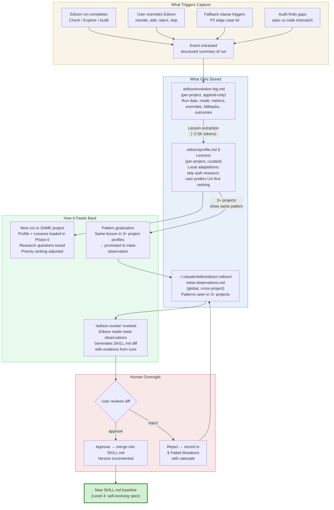

# P3: Self-Improvement Feedback Loop

## Reading the Diagram

**Yellow (Capture):** Four event types trigger data capture. Edison runs, user corrections, fallback triggers from P2's edge case hardening, and post-implementation audits all produce structured events.

**Blue (Storage):** Three tiers, increasing scope. The evolution log is raw append-only data. Project lessons are curated local adaptations. Meta-observations are cross-project patterns that graduated through the 3-project threshold.

**Green (Feedback):** Three feedback paths at different cadences. Per-run feedback is automatic (profile loads on Phase 0). Pattern graduation is passive (happens when lessons accumulate). Spec evolution is explicit (user invokes `/edison evolve`).

**Red (Gate):** Human always decides. Approved changes become the new baseline. Rejected changes are recorded with rationale to prevent re-proposal (failure memory from Approach 3, incorporated into the recommended Approach 2).

## Key Design Decisions

1. **Task-level is automatic, meta-level is gated.** Profile lessons update without approval (they are advisory, project-scoped). SKILL.md mutations always require human review.

2. **Graduation threshold prevents noise.** A lesson must appear in 3+ project profiles before it becomes a meta-observation. This filters project-specific quirks from universal patterns.

3. **Failure memory prevents cycling.** Rejected mutations are recorded. Edison will not re-propose a change that was already reviewed and rejected, unless the evidence base has changed substantially.

4. **Token cost is marginal.** The capture and lesson extraction add ~2-5K tokens per run. The evolution step (reading meta-observations, generating a diff) is heavier (~20-50K) but runs only on explicit invocation, not every run.
